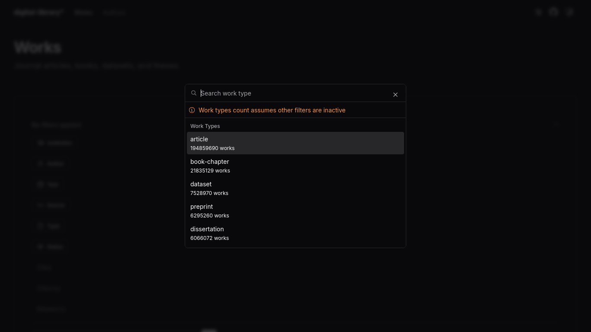

# Overview

digital-library* is an OpenAlex frontend for browsing scholarly documents and authors.


## Filtering works

Works can be filtered by work title, author, publication year, source, work type, and access status.


Works can also be filtered by whether a fulltext version is available (though it does not indicate that a work is completely open to access).


### Filter by work title


### Filter by author


### Filter by publication year


### By source


### Filter by work type



### Filter by access status


## Filtering authors

The "authors" page has the same Institution and Author filter as the "works" page.


### Show authors with an ORCID iD

Authors can also be filtered by if they have an ORCID iD.


# Notes

*placeholder name

<!-- # create-svelte

Everything you need to build a Svelte project, powered by [`create-svelte`](https://github.com/sveltejs/kit/tree/main/packages/create-svelte).

## Creating a project

If you're seeing this, you've probably already done this step. Congrats!

```bash
# create a new project in the current directory
npm create svelte@latest

# create a new project in my-app
npm create svelte@latest my-app
```

## Developing

Once you've created a project and installed dependencies with `npm install` (or `pnpm install` or `yarn`), start a development server:

```bash
npm run dev

# or start the server and open the app in a new browser tab
npm run dev -- --open
```

## Building

To create a production version of your app:

```bash
npm run build
```

You can preview the production build with `npm run preview`.

> To deploy your app, you may need to install an [adapter](https://kit.svelte.dev/docs/adapters) for your target environment. -->

<!-- # create-svelte

Everything you need to build a Svelte project, powered by [`create-svelte`](https://github.com/sveltejs/kit/tree/main/packages/create-svelte).

## Creating a project

If you're seeing this, you've probably already done this step. Congrats!

```bash
# create a new project in the current directory
npm create svelte@latest

# create a new project in my-app
npm create svelte@latest my-app
```

## Developing

Once you've created a project and installed dependencies with `npm install` (or `pnpm install` or `yarn`), start a development server:

```bash
npm run dev

# or start the server and open the app in a new browser tab
npm run dev -- --open
```

## Building

To create a production version of your app:

```bash
npm run build
```

You can preview the production build with `npm run preview`.

> To deploy your app, you may need to install an [adapter](https://kit.svelte.dev/docs/adapters) for your target environment. -->
